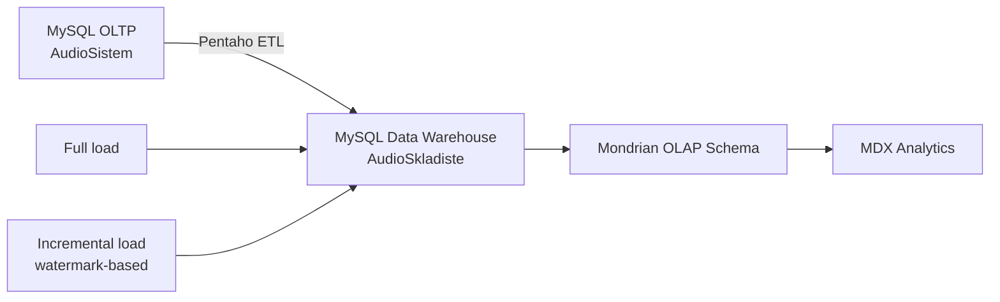

# Audio Analytics Data Warehouse

An end-to-end data engineering project that transforms data from a normalized MySQL transactional database into an analytics-ready star schema. The pipeline supports both full and incremental loads, and exposes OLAP cubes for listening, rating, and subscription analysis.

## What this project demonstrates

- Dimensional modeling with shared dimensions and three fact tables
- Full and incremental ETL workflows in Pentaho Data Integration (PDI/Kettle)
- Change tracking through a warehouse watermark (`POSLEDNJA_IZMENA`)
- Source-to-warehouse transformations and aggregate loading
- OLAP modeling with Mondrian and analytical queries in MDX
- Referential integrity, validation rules, and database triggers in MySQL

## Architecture



The source system contains users, audio recordings, categories, subscriptions, listening events, and ratings. The warehouse uses conformed dimensions for time, gender, age range, and location.

| Fact table | Grain | Measures |
| --- | --- | --- |
| `CINJENICA_SLUSANJE` | Time × audio × listener demographics × listener/owner location | Total listening minutes |
| `CINJENICA_OCENA` | Time × category × listener demographics × listener/owner location | Rating count, average rating |
| `CINJENICA_PRETPLATA` | Time × subscriber demographics × location | Subscription revenue |

## Repository structure

```text
.
├── etl/
│   ├── full-load/          # Initial warehouse load
│   └── incremental-load/   # Watermark-based updates
├── olap/
│   ├── audio_warehouse.xml # Mondrian schema
│   └── queries.mdx         # Example analytical queries
└── sql/
    ├── source_schema.sql
    ├── source_seed.sql
    ├── source_incremental_seed.sql
    └── warehouse_schema.sql
```

## Technology

- MySQL
- Pentaho Data Integration 9.x (Spoon/Kettle)
- Pentaho Schema Workbench / Mondrian
- SQL and MDX

## Run locally

### 1. Create and seed the source database

Run the following files in order:

```bash
mysql -u root -p < sql/source_schema.sql
mysql -u root -p < sql/source_seed.sql
```

### 2. Create the warehouse

```bash
mysql -u root -p < sql/warehouse_schema.sql
```

### 3. Configure Pentaho connections

Define these variables in your Pentaho `kettle.properties` file (or pass them to the runner):

```properties
DB_HOST=localhost
DB_USER=root
DB_PASSWORD=your-local-password
```

The transformations use two MySQL databases:

- source database: `AudioSistem`
- warehouse database: `AudioSkladiste`

The orchestration jobs use `${Internal.Job.Filename.Directory}`, so the repository can be moved or cloned without editing machine-specific paths.

### 4. Run a full load

Open and run:

```text
etl/full-load/full_load.kjb
```

It clears the analytical tables, loads dimensions, and then loads facts.

### 5. Run an incremental load

Add new source records:

```bash
mysql -u root -p < sql/source_incremental_seed.sql
```

Then open and run:

```text
etl/incremental-load/incremental_load.kjb
```

The workflow loads records newer than the stored watermark and updates the watermark after the fact and dimension loads finish successfully.

### 6. Explore the OLAP model

Open `olap/audio_warehouse.xml` in Pentaho Schema Workbench, configure the `AudioSkladiste` connection, publish the schema, and run the examples from `olap/queries.mdx`.

## Notes

The SQL files contain synthetic demonstration data only. This repository is a portfolio version of a university information-systems project; machine-specific paths and personal contact data were removed.
